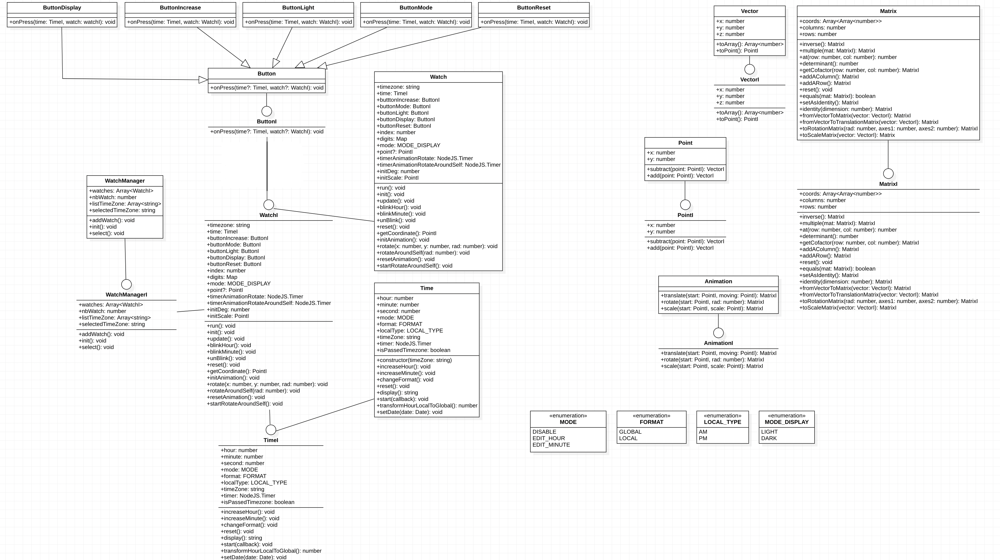
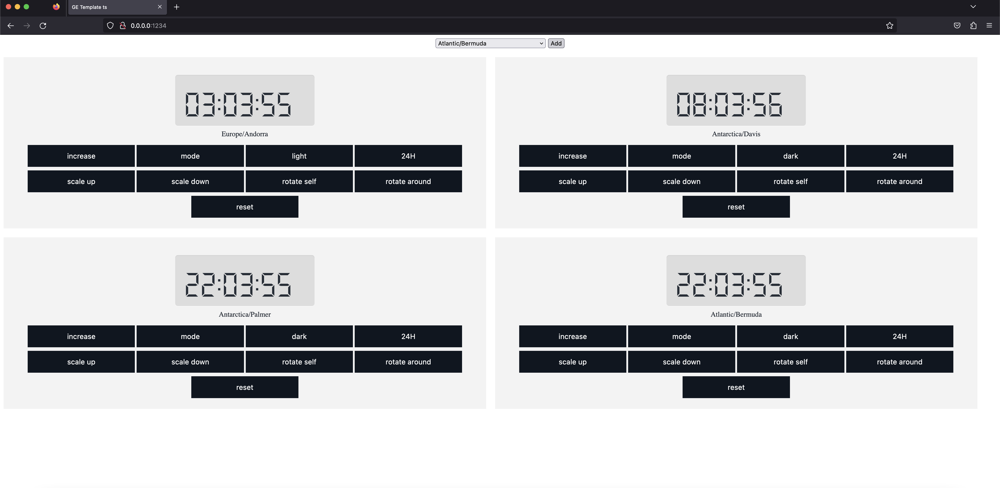

# GE-Healthcare Test
Typescript Watch with animations

## Diagram of project
The diagram of project is as below, note that it is included all questions of test



## API Documentation
Documention is available [here](https://nguyvan.github.io/test-ge-healthcare/index.html)

## Demo
Video demo:


Screenshot add multiple clocks:



## Install and run project
```javascript
npm install
npm run build
npm run start
```
